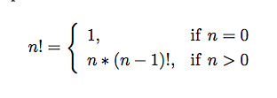

# 递归

>    Recursion is a process for solving problems by subdividing a larger
>    problem into smaller cases of the problem itself and then solving
>    the smaller, more trivial parts.

递归是计算机科学里出现非常多的一个概念，有时候用递归解决问题看起来非常简单优雅。
之前讲过的数据结构中我们并没有使用递归，因为递归涉及到调用栈，可能会让初学者搞晕。这一章我们开始介绍递归，
后边讲到树和一些排序算法的时候我们还会碰到它。我非常推荐你先看看《算法图解》第三章 递归，
举的例子比较浅显易懂。


# 什么是递归？
递归用一种通俗的话来说就是自己调用自己，但是需要分解它的参数，让它解决一个更小一点的问题，当问题小到一定规模的时候，需要一个递归出口返回。
这里举一个和其他很多老套的教科书一样喜欢举的例子，阶乘函数，我觉得用来它演示再直观不过。它的定义是这样的：



我们很容易根据它的定义写出这样一个递归函数，因为它本身就是递归定义的。

```py
def fact(n):
    if n == 0:
        return 1
    else:
        return n * fact(n-1)
```
看吧，几乎完全是按照定义来写的。我们来看下递归函数的几个特点:

- 递归必须包含一个基本的出口(base case)，否则就会无限递归，最终导致栈溢出。比如这里就是 n == 0 返回 1
- 递归必须包含一个可以分解的问题(recursive case)。 要想求得 fact(n)，就需要用 n * fact(n-1)
- 递归必须必须要向着递归出口靠近(toward the base case)。 这里每次递归调用都会 n-1，向着递归出口 n == 0 靠近


# 调用栈
看了上一个例子你可能觉得递归好简单，先别着急，我们再举个简单的例子，上边我们并没有讲递归如何工作的。
假如让你输出从 1 到 10 这十个数字，如果你是个正常人的话，我想你的第一反应都是这么写：

```py
def print_num(n):
    for i in range(1, n + 1):    # 注意很多编程语言使用的都是 从 0 开始的左闭右开区间, python 也不例外
        print(i)


if __name__ == '__main__':
    print_num(10)
```

我们尝试写一个递归版本，不就是自己调用自己嘛：

```py
def print_num_recursive(n):
    if n > 0:
        print_num_recursive(n-1)
        print(n)
```

你猜下它的输出？然后我们调换下 print 顺序，你再猜下它的输出

```py
def print_num_recursive_revserve(n):
    if n > 0:
        print(n)
        print_num_recursive_revserve(n-1)
```
你能明白是为什么吗？我建议你运行下这几个小例子，它们很简单但是却能说明问题。
计算机内部使用调用栈来实现递归，这里的栈一方面指的是内存中的栈区，一方面栈又是之前讲到的后进先出这种数据结构。
每当进入递归函数的时候，系统都会为当前函数开辟内存保存当前变量值等信息，每个调用栈之间的数据互不影响，新调用的函数
入栈的时候会放在栈顶。视频里我们会画图来演示这个过程。

递归只用大脑不用纸笔模拟的话很容易晕，因为明明是同一个变量名字，但是在不同的调用栈里它是不同的值，所以我建议
你最好手动画画这个过程。


# 用栈模拟递归
刚才说到了调用栈，我们就用栈来模拟一把。之前栈这一章我们讲了如何自己实现栈，不过这里为了不拷贝太多代码，我们直接用 collections.deque 就可以
快速实现一个简单的栈。

```py
from collections import deque


class Stack(object):
    def __init__(self):
        self._deque = deque()

    def push(self, value):
        return self._deque.append(value)

    def pop(self):
        return self._deque.pop()

    def is_empty(self):
        return len(self._deque) == 0


def print_num_use_stack(n):
    s = Stack()
    while n > 0:    # 不断将参数入栈
        s.push(n)
        n -= 1

    while not s.is_empty():    # 参数弹出
        print(s.pop())
```
这里结果也是输出 1 到 10，只不过我们是手动模拟了入栈和出栈的过程，帮助你理解计算机是如何实现递归的，是不是挺简单！现在你能明白为什么上边 print_num_recursive print_num_recursive_revserve 两个函数输出的区别了吗？

# 尾递归
上边的代码示例中实际上包含了两种形式的递归，一种是普通的递归，还有一种叫做尾递归：

```py
def print_num_recursive(n):
    if n > 0:
        print_num_recursive(n-1)
        print(n)


def print_num_recursive_revserve(n):
    if n > 0:
        print(n)
        print_num_recursive_revserve(n-1)    # 尾递归
```

概念上它很简单，就是递归调用放在了函数的最后。有什么用呢？
普通的递归, 每一级递归都产生了新的局部变量, 必须创建新的调用栈, 随着递归深度的增加, 创建的栈越来越多, 造成爆栈。虽然尾递归调用也会创建新的栈,
但是我们可以优化使得尾递归的每一级调用共用一个栈!, 如此便可解决爆栈和递归深度限制的问题!
不幸的是 python 默认不支持尾递归优化（见延伸阅读），不过一般尾递归我们可以用一个迭代来优化它。


# 著名的汉诺塔问题


# 延伸阅读
递归是个非常重要的概念，我们后边的数据结构和算法中还会多次碰到它，我建议你多阅读一些资料加深理解：

- 《算法图解》第三章 递归
- 《Data Structures and Algorithms in Python》 第 10 章 Recursion
- [《Python开启尾递归优化!》](https://segmentfault.com/a/1190000007641519)
- [尾调用优化](http://www.ruanyifeng.com/blog/2015/04/tail-call.html)

# 思考题
- 你能举出其他一些使用到递归的例子吗？
- 实现一个 flatten 函数，把嵌套的列表扁平化，你需要用递归函数来实现。比如 [[1,2], [1,2,3] -> [1,2,1,2,3]
- 使用递归和循环各有什么优缺点，你能想到吗？怎么把一个尾递归用迭代替换？
- 递归有时候虽然很优雅，但是时间复杂度却不理想，比如斐波那契数列，它的表达式是 F(n) = F(n-1) + F(n-2)，你能计算它的时间复杂度吗？我们怎样去优化它
