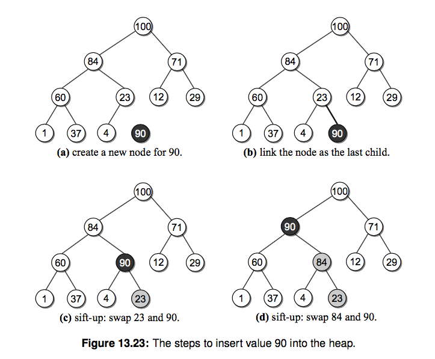
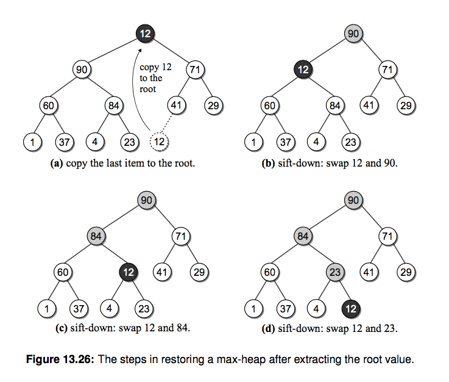
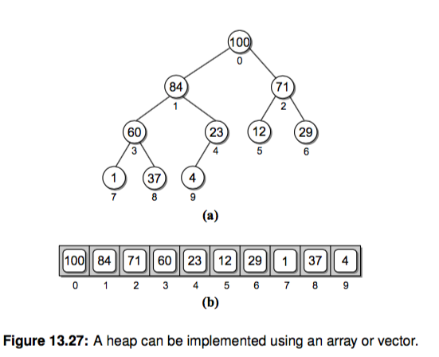

# 堆(heap)
前面我们讲了两种使用分治和递归解决排序问题的归并排序和快速排序，中间又穿插了一把树和二叉树，
本章我们开始介绍另一种有用的数据结构堆(heap)， 以及借助堆来实现的堆排序，相比前两种排序算法要稍难实现一些。
最后我们简单提一下 python 标准库内置的 heapq 模块。


# 什么是堆？
堆是一种完全二叉树（请你回顾下上一章的概念），有最大堆和最小堆两种。

- 最大堆: 对于每个非叶子节点 V，V 的值都比它的两个孩子大，称为 最大堆特性(heap order property)
最大堆里的根总是存储最大值，最小的值存储在叶节点。
- 最小堆：和最大堆相反，每个非叶子节点 V，V 的两个孩子的值都比它大。


# 堆的操作
堆提供了很有限的几个操作：

- 插入新的值。插入比较麻烦的就是需要维持堆的特性。需要 sift-up 操作，具体会在视频和代码里解释，文字描述起来比较麻烦。
- 获取并移除根节点的值。每次我们都可以获取最大值或者最小值。这个时候需要把底层最右边的节点值替换到 root 节点之后
执行 sift-down 操作。




# 堆的表示
上一章我们用一个节点类和二叉树类表示树，这里其实用数组就能实现堆。



仔细观察下，因为完全二叉树的特性，树不会有间隙。对于数组里的一个下标 i，我们可以得到它的父亲和孩子的节点对应的下标：

```
parent = int((i-1) / 2)    # 取整
left = 2 * i + 1
right = 2 * i + 2
```
超出下标表示没有对应的孩子节点。

# 实现一个最大堆
我们将在视频里详细描述和编写各个操作

```py
class MaxHeap(object):
    def __init__(self, maxsize=None):
        self.maxsize = maxsize
        self._elements = Array(maxsize)
        self._count = 0

    def __len__(self):
        return self._count

    def add(self, value):
        if self._count >= self.maxsize:
            raise Exception('full')
        self._elements[self._count] = value
        self._count += 1
        self._siftup(self._count-1)  # 维持堆的特性

    def _siftup(self, ndx):
        if ndx > 0:
            parent = int((ndx-1)/2)
            if self._elements[ndx] > self._elements[parent]:    # 如果插入的值大于 parent，一直交换
                self._elements[ndx], self._elements[parent] = self._elements[parent], self._elements[ndx]
                self._siftup(parent)    # 递归

    def extract(self):
        if self._count <= 0:
            raise Exception('empty')
        value = self._elements[0]    # 保存 root 值
        self._count -= 1
        self._elements[0] = self._elements[self._count]    # 最右下的节点放到root后siftDown
        self._siftdown(0)    # 维持堆特性
        return value

    def _siftdown(self, ndx):
        left = 2 * ndx + 1
        right = 2 * ndx + 2
        # determine which node contains the larger value
        largest = ndx
        if (left < self._count and     # 有左孩子
                self._elements[left] >= self._elements[largest] and
                self._elements[left] >= self._elements[right]):  # 原书这个地方没写实际上找的未必是largest
            largest = left
        elif right < self._count and self._elements[right] >= self._elements[largest]:
            largest = right
        if largest != ndx:
            self._elements[ndx], self._elements[largest] = self._elements[largest], self._elements[ndx]
            self._siftdown(largest)


def test_maxheap():
    import random
    n = 5
    h = MaxHeap(n)
    for i in range(n):
        h.add(i)
    for i in reversed(range(n)):
        assert i == h.extract()
```

# 实现堆排序
上边我们实现了最大堆，每次我们都能 extract 一个最大的元素了，于是一个倒序排序函数就能很容易写出来了：

```py
def heapsort_reverse(array):
    length = len(array)
    maxheap = MaxHeap(length)
    for i in array:
        maxheap.add(i)
    res = []
    for i in range(length):
        res.append(maxheap.extract())
    return res


def test_heapsort_reverse():
    import random
    l = list(range(10))
    random.shuffle(l)
    assert heapsort_reverse(l) == sorted(l, reverse=True)
```

# python 里的 heapq
python 其实自带了 heapq 模块，用来实现堆的相关操作，原理是类似的。请你阅读相关文档并使用内置的 heapq 模块完成堆排序。

# 练习题

- 这里我用最大堆实现了一个 heapsort_reverse 函数，请你实现一个正序排序的函数。似乎不止一种方式
- 请你实现一个最小堆，你需要修改那些代码呢？
- 我们实现的堆排序是 inplace 的吗，如果不是，你能改成 inplace 的吗？
- 堆排序的时间复杂度是多少？ siftup 和 siftdown 的时间复杂度是多少？（小提示：考虑树的高度，它决定了操作次数）


# 延伸阅读
- 《算法导论》第 6 章 Heapsort
- 《Data Structures and Algorithms in Python》 13.5 节 Heapsort
- 阅读 Python heapq 模块的文档

# Leetcode

合并 k 个有序链表 https://leetcode.com/problems/merge-k-sorted-lists/description/
