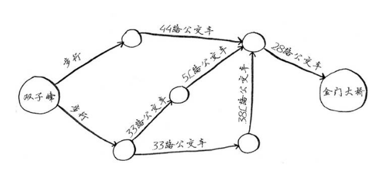

# 图
之前们讲过很多数据结构了，包括线性结构、链式结构、树结构等，这些结构基本就能应付我们的业务开发了。
这一章来看下图结构，图的使用也比较广泛，比如人物关系、路径选择等等，相比前面的一些数据结构和算法要相对复杂一些。
不过也不用担心，除非是特定的后端业务，一般图结构的使用比较少。这一章我们简单地介绍下图结构，以及图的搜索算法。

# 什么是图？
我们先来考虑日常生活中的一个问题，我们在出行的时候一般会考虑使用地图软件搜下从一个地点到另外一个地点的路线。
这里把地点抽象成一个圈，路径抽象成线，于是乎就有了下面的图，其实还是非常好理解的。

简单地说就是有节点(node)和边(edge)组成的一种数据结构，相邻的节点称之为邻居。 注意图分为有向图和无向图，
比如有些路是单行道，有些是双行道，有向图我们用箭头指向，无向图就是一条直线连接。

# 图的表示
那我们怎么把一个图抽象成代码来表示呢？因为最终我们还是需要代码来实现的。通常有两种表示方法，邻接表法和邻接矩阵表示。

# 思考题

# 延伸阅读
- [数据结构之图](https://www.zybuluo.com/guoxs/note/249812)
- 《算法图解》第六章
